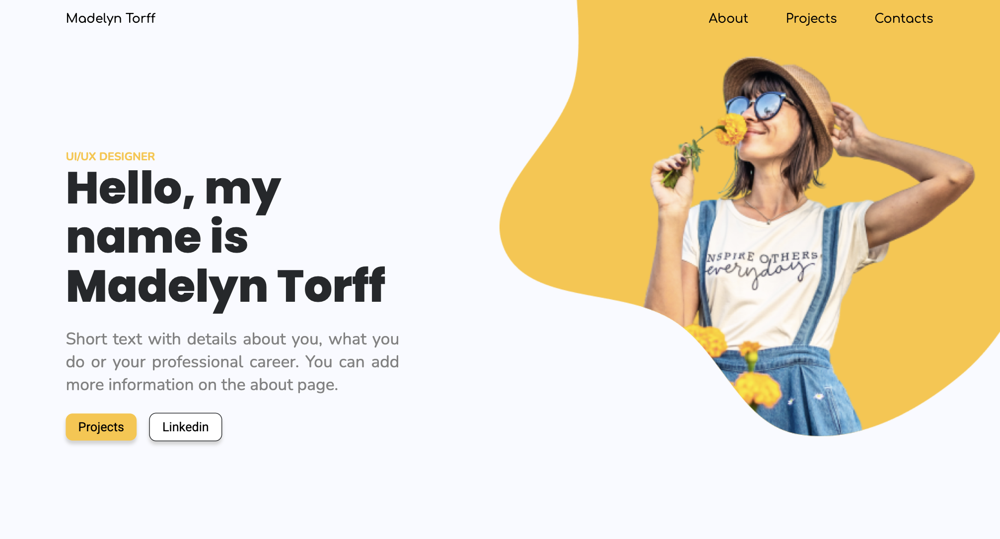

<h1 align="center">Projet Portfolio en React</h3>



<!-- TABLE OF CONTENTS -->
## Sommaire
<ol>
  <li>
    <a href="#about-the-project">À propos</a>
    <ul>
      <li><a href="#design">Ressource de design</a></li>
      <li><a href="#built-with">Technologies</a></li>
    </ul>
  </li>
  <li>
    <a href="#getting-started">Configuration</a>
    <ul>
      <li><a href="#prerequisites">Prérequis</a></li>
      <li><a href="#installation">Installation</a></li>
    </ul>
  </li>
  <li><a href="#contact">Contact</a></li>
  <li><a href="#acknowledgments">Ressources</a></li>
</ol>


<!-- ABOUT THE PROJECT -->
## À propos du projet <a id="about-the-project"></a>

Ce projet transforme une maquette professionnelle en un site
web fonctionnel, performant et responsive.

### Ressource de design <a id="design"></a>
La maquette est disponible sur Figma via le lien suivant :  
https://www.figma.com/design/mia4DAviXoGlmtZGMX95Jx/Personal-Portfolio-Website-Template--node-id=0-1&p=f&t=4jIvVt9ynZh4hGWo-0

### Technologies <a id="built-with"></a>

* [![Typescript][Typescript]][Typescript-url]
* [![React][React.js]][React-url]
* [![Vite][Vite]][Vite-url]


<!-- GETTING STARTED -->
## Configuration <a id="getting-started"></a>

### Prérequis <a id="prerequisites"></a>

Pour faire tourner ce projet, vous devez avoir installé [Node.js](https://nodejs.org/). Les outils comme **Vite** et **TypeScript** seront ensuite gérés localement ou globalement.  

Assurez-vous d'avoir la dernière version de npm installée :
```sh
npm install npm@latest -g
```

### Installation <a id="installation"></a>

1. Cloner le dépôt
  ```sh
  git clone https://github.com/Crii-san/portfolio-react.git
  ```
2. Installer les packages npm
  ```sh
  npm install
  ```
3. Lancer le serveur de développement
  ```sh
  npm run dev
  ```

<!-- CONTACT -->
## Contact <a id="contact"></a>

Christelle SOUKA - christelle.souka@efrei.net

Project Link : [https://github.com/Crii-san/portfolio-react](https://github.com/Crii-san/portfolio-react)


<!-- ACKNOWLEDGMENTS -->
## Ressources  <a id="acknowledgments"></a>

* [Img Shields](https://shields.io)
* [Font Awesome](https://fontawesome.com)
* [React Icons](https://react-icons.github.io/react-icons/search)

<p align="right">(<a href="#readme-top">Retour en haut</a>)</p>


<!-- MARKDOWN LINKS -->
[React.js]: https://img.shields.io/badge/React-20232A?style=for-the-badge&logo=react&logoColor=61DAFB
[React-url]: https://reactjs.org/

[Vite]: https://img.shields.io/badge/Vite-646CFF?style=for-the-badge&logo=Vite&logoColor=white
[Vite-url]: https://vite.dev/guide/

[Typescript]: https://img.shields.io/badge/TypeScript-3178C6?style=for-the-badge&logo=typescript&logoColor=white
[Typescript-url]: https://www.typescriptlang.org/

